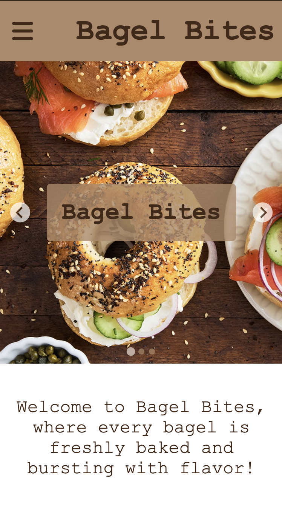
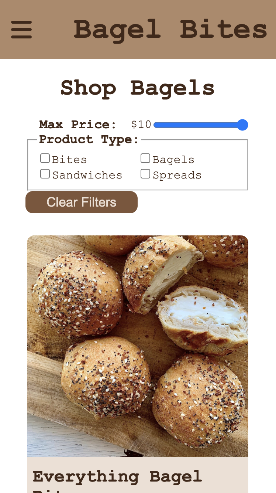
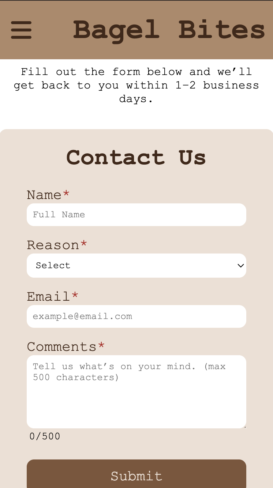

# Bagel Bites
<p align="center">
  
  
  
</p>

## Live Website
[Bagel Bites](https://e-commerce-react-psi-three.vercel.app/)
## Description

This is a full-stack e-commerce application built with React (Vite) for the frontend and Node.js/Express for the backend. It features a product catalog with dynamic filtering, a contact form with validation, and fully responsive design for desktop, tablet, and mobile.

## Getting Started
### Installing
```
Fork and clone the repo
```
### Executing Program - Server
```
# cd into the application directory
cd server

# Install Dependencies
npm install

# Create a .env file with your database and environment variables:
DB_HOST=your-db-host
DB_USER=your-db-user
DB_PASSWORD=your-db-password
DB_NAME=your-db-name
FRONTEND_URL=https://your-frontend-url

# Start backend locally
npm run dev

```
### Executing Program - Client
```
# Navigate to the client folder:
cd client

# Install Dependencies
npm install

# Create a .env file with your API URL:
VITE_API_URL=http://localhost:5000

# Start frontend locally
npm run dev

```